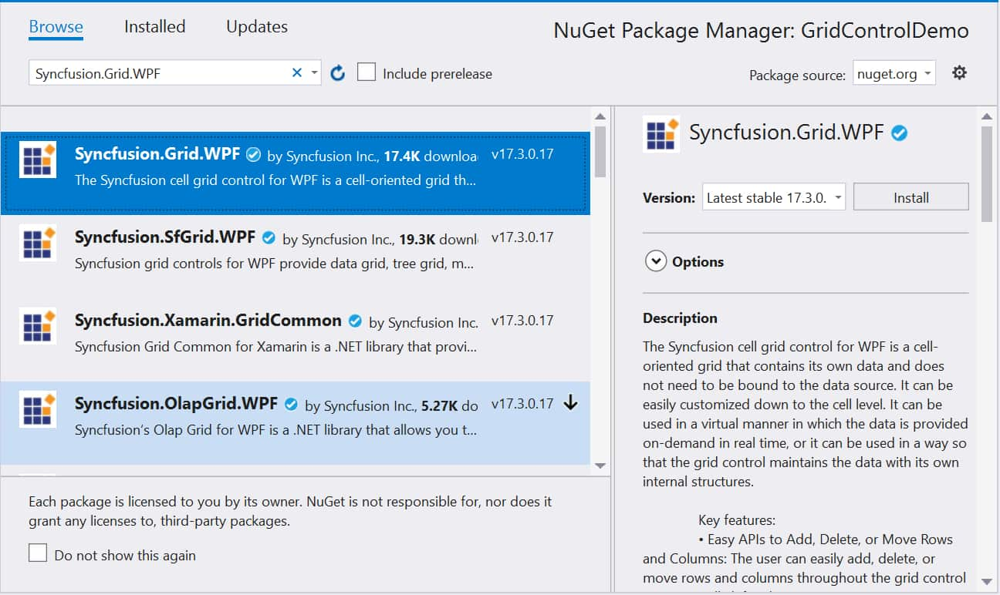
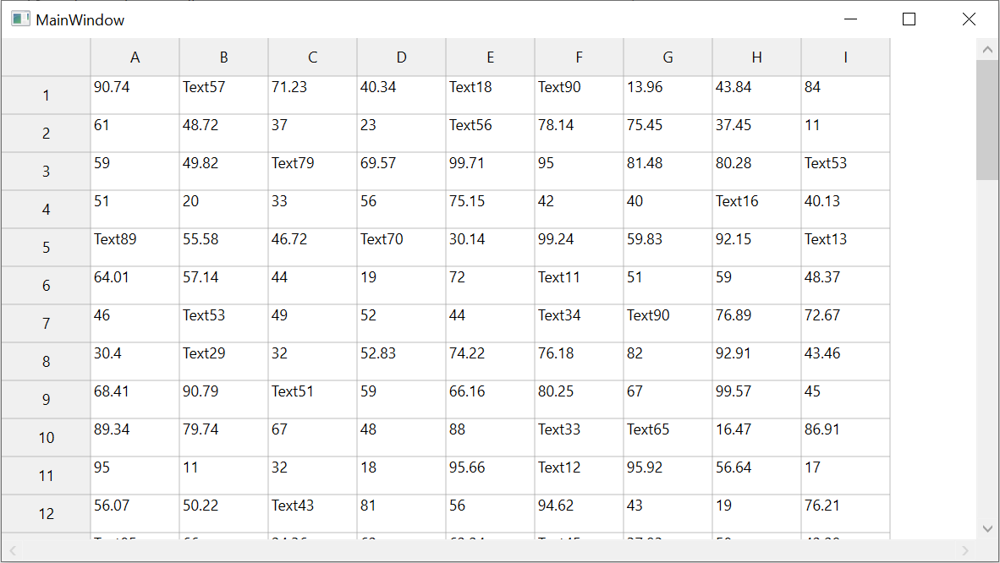

# How to Create WPF GridControl in VB.NET?

This example demonstrates how to create application with [WPF GridControl](https://www.syncfusion.com/wpf-controls/excel-like-grid) in vb.net.

The GridControl is a cell-oriented control for displaying tabular data. It does not make any assumptions regarding the structure of the data. Users can customize it down to the cell level and can use a grid virtually where the data is provided on demand in real-time. If you are searching for Grid capable of binding different types of data sources and handling data (sorting, filtering, etc.), please refer to the [WPF DataGrid](https://www.syncfusion.com/wpf-controls/datagrid) (SfDataGrid) control.

### Creating Grid Control in VB.Net

1. Create a new VB.Net WPF application project.

2. Install the [Syncfusion.Grid.WPF](https://www.nuget.org/packages/Syncfusion.Grid.WPF) NuGet package as a reference to your .NET Framework applications from NuGet.org.



3. Add the following Syncfusion namespace in MainWindow.xaml to make use of the GridControl

``` xml
<Window x:Class="MainWindow"
        xmlns="http://schemas.microsoft.com/winfx/2006/xaml/presentation"
        xmlns:x="http://schemas.microsoft.com/winfx/2006/xaml"
        xmlns:d="http://schemas.microsoft.com/expression/blend/2008"
        xmlns:mc="http://schemas.openxmlformats.org/markup-compatibility/2006"
        xmlns:local="clr-namespace:GridControlDemo"
        mc:Ignorable="d"
        xmlns:Syncfusion="clr-namespace:Syncfusion.Windows.Controls.Grid;assembly=Syncfusion.Grid.WPF" 
        Title="MainWindow" Height="450" Width="800">
    <Grid>       
    </Grid>
</Window>
```

4. Add the GridControl inside the `ScrollViewer` control which provides scrollable area to other visible elements that it contains.   

``` xml
<Window x:Class="MainWindow"
        xmlns="http://schemas.microsoft.com/winfx/2006/xaml/presentation"
        xmlns:x="http://schemas.microsoft.com/winfx/2006/xaml"
        xmlns:d="http://schemas.microsoft.com/expression/blend/2008"
        xmlns:mc="http://schemas.openxmlformats.org/markup-compatibility/2006"
        xmlns:local="clr-namespace:GridControlDemo"
        mc:Ignorable="d"
        xmlns:Syncfusion="clr-namespace:Syncfusion.Windows.Controls.Grid;assembly=Syncfusion.Grid.WPF" 
        Title="MainWindow" Height="450" Width="800">
    <Grid>
        <ScrollViewer HorizontalScrollBarVisibility="Visible">
            <Syncfusion:GridControl x:Name="gridControl"/>
        </ScrollViewer>
    </Grid>
</Window>
```

### Defining Rows and Columns

Users can add the number of rows and columns in grid control by using [RowCount](https://help.syncfusion.com/cr/wpf/Syncfusion.Windows.Controls.Grid.GridModel.html#Syncfusion_Windows_Controls_Grid_GridModel_RowCount) and [ColumnCount](https://help.syncfusion.com/cr/wpf/Syncfusion.Windows.Controls.Grid.GridModel.html#Syncfusion_Windows_Controls_Grid_GridModel_ColumnCount) properties.

``` vb
'Specifying row and column count
gridControl.Model.RowCount = 50
gridControl.Model.ColumnCount = 10
```

### Populating Data

Data can be populated in GridControl using one of the following methods.

1. Populate data by looping through the cells in Grid

``` vb
'Specifying row and column count
gridControl.Model.RowCount = 50
gridControl.Model.ColumnCount = 10
 
Dim r As New Random()
 
For row As Integer = 1 To 49
    For col As Integer = 1 To 9
        gridControl.Model(row, col).CellValue = r.Next(10, 100)      
    Next col
Next row
```

2. Populate data by handling the [QueryCellInfo](https://help.syncfusion.com/cr/wpf/Syncfusion.Windows.Controls.Grid.GridModel.html#Syncfusion_Windows_Controls_Grid_GridModel_QueryCellInfo) event of Grid (Virtual Mode). This will load the data in and on-demand basis, ensuring optimized performance.

``` vb
'Specifying row and column count
gridControl.Model.RowCount = 50
gridControl.Model.ColumnCount = 10 
AddHandler gridControl.QueryCellInfo, AddressOf grid_QueryCellInfo
 
Private Sub grid_QueryCellInfo(ByVal sender As Object, ByVal e As GridQueryCellInfoEventArgs)
    If e.Style.RowIndex = 0 AndAlso e.Style.ColumnIndex = 0 Then
        Return
        'set value for column headers
    ElseIf e.Style.RowIndex = 0 Then
        e.Style.CellValue = GridRangeInfo.GetAlphaLabel(e.Cell.ColumnIndex)
        'set value for row headers
    ElseIf e.Style.ColumnIndex = 0 Then
        e.Style.CellValue = e.Style.RowIndex
        'set value for cells
    Else
        e.Style.CellValue = rand.Next(10, 100)
    End If
End Sub
```



### Editing

GridControl has the default support for editing the cells. Editing can be customized for each cell using various events like `CurentCellStartEditing`, `CurrentCellActivating` and `CurrentCellChanging`, etc. Also, GridControl support various built-in editors such as `DoubleEdit`, `PercentEdit`, `IntegerEdit`, `MaskEdit`, `RichText`, `UpDownEdit`, `CurrencyEdit` and `DateTimeEdit` which can be configured for each cell in GridControl.

### Formulas

GridControl supports Excel-like formulas in each cell and allows to enter algebraic expressions using formulas and cell references by setting the cell type of a cell to `FormulaCell`. The control comes with an extensive formula function library that supports more than 150 built-in formulas.

### Excel-like features

GridControl has the built-in supports to change the appearance like Microsoft Excel current cell, selection and selection frame by using [ExcelLikeCurrentCell](https://help.syncfusion.com/cr/wpf/Syncfusion.Windows.Controls.Grid.GridModelOptions.html#Syncfusion_Windows_Controls_Grid_GridModelOptions_ExcelLikeCurrentCell), [ExcelLikeSelection](https://help.syncfusion.com/cr/wpf/Syncfusion.Windows.Controls.Grid.GridModelOptions.html#Syncfusion_Windows_Controls_Grid_GridModelOptions_ExcelLikeSelection) and [ExcelLikeSelectionFrame](https://help.syncfusion.com/cr/wpf/Syncfusion.Windows.Controls.Grid.GridModelOptions.html#Syncfusion_Windows_Controls_Grid_GridModelOptions_ExcelLikeSelectionFrame) properties respectively.

### Summary

GridControl has the support for various cell types, exporting options, support for serialization, printing support and support to customize the appearance, etc. For more information on the GridControl and its features, please see our [User Guide Documentation](https://help.syncfusion.com/wpf/gridcontrol/overview). You can also refer to the [Feature Tour](https://www.syncfusion.com/wpf-controls/excel-like-grid) site to get an overview on all the features in grid. Refer this [documentation](https://help.syncfusion.com/wpf/control-dependencies#grid-control) to know about the required assemblies for creating GridControl.